# Contribuições mensais no portal de acessos

Prints do PR #173: pedido por seção, acesso total da diretoria financeira, gestão por seção e o responsável vendo só os filhos. Dados fictícios, em um site de teste local.

## Pedido por seção

**1. Card com a seção liberada, o pedido em aprovação e "Pedir outra seção"**

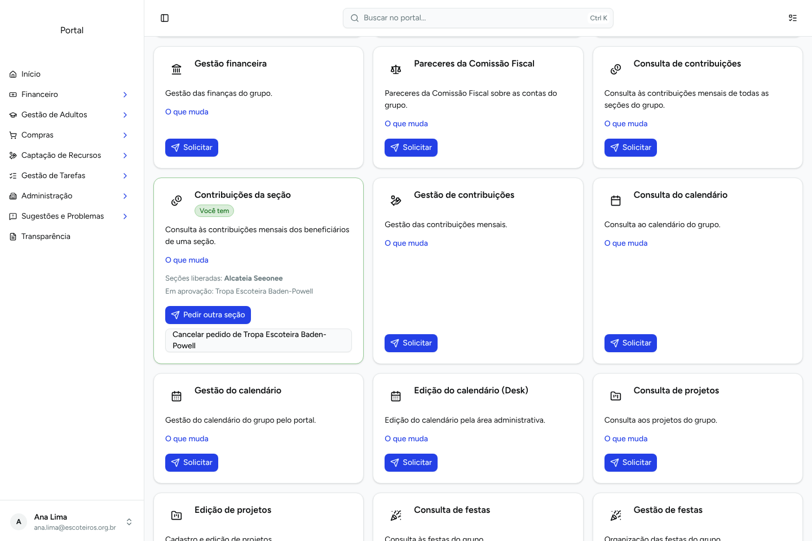

**2. Pedido com escolha da seção**

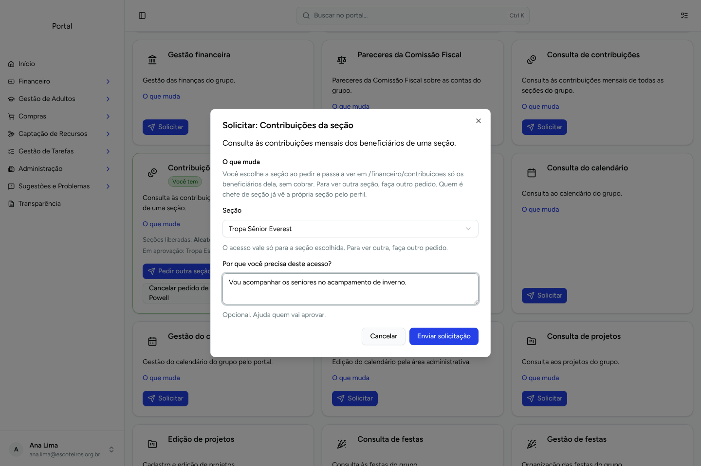

**3. Minhas solicitações, com a seção no título**

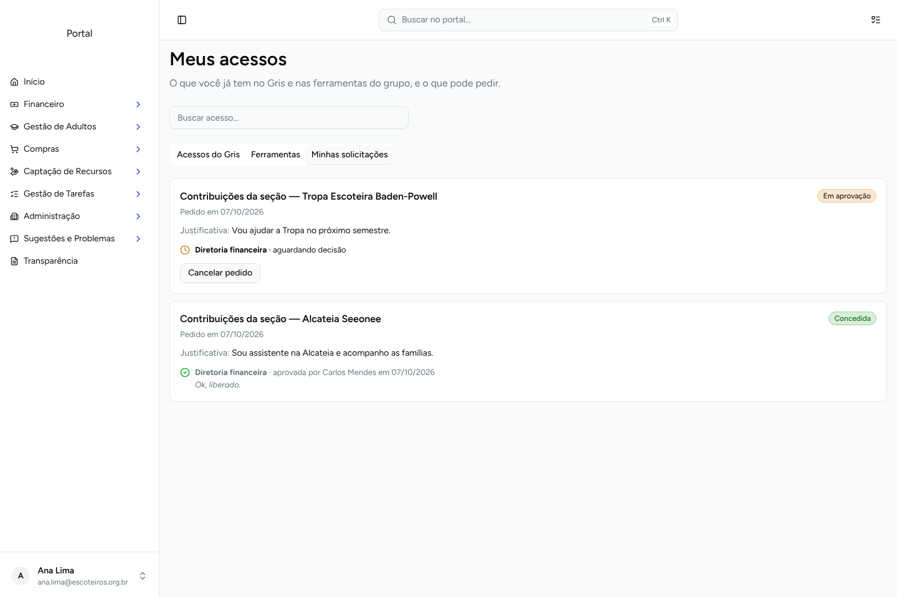

**4. `/financeiro/contribuicoes` recortado na seção concedida**

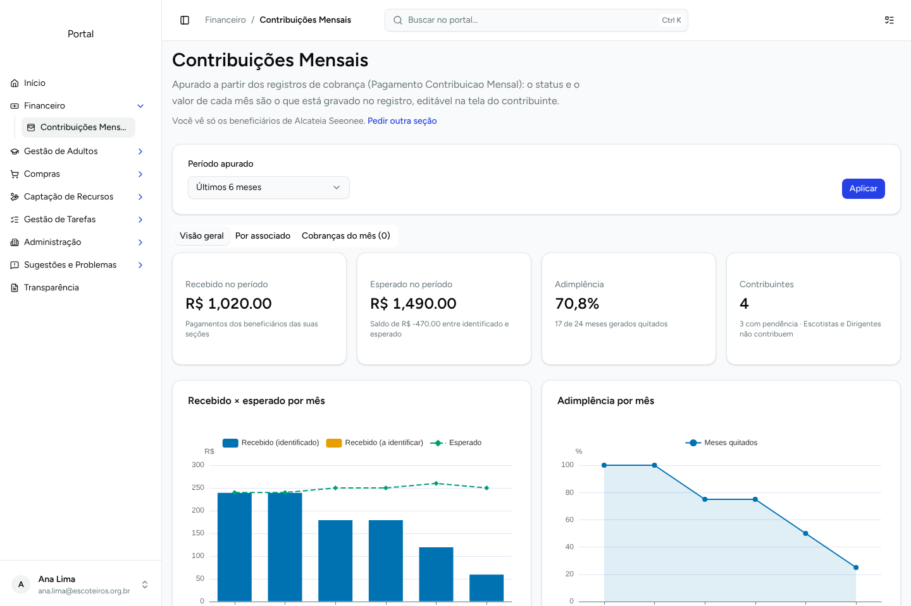

**5. Por associado: só os beneficiários da Alcateia**

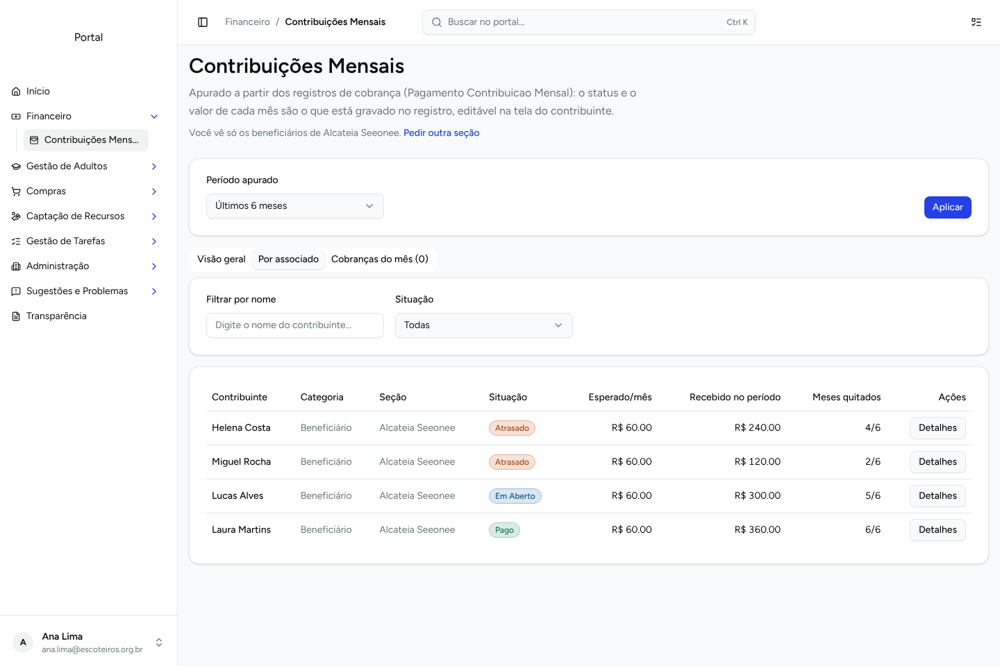

## Diretoria financeira

**6. Aprovações pendentes (seção e acesso total)**

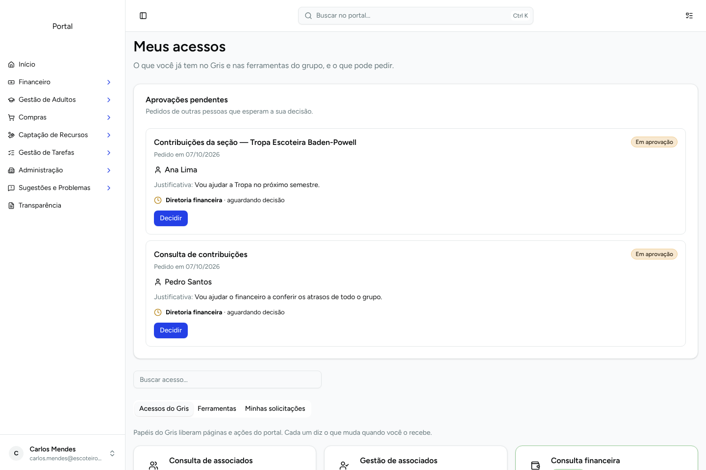

**7. Decidir o pedido de seção**

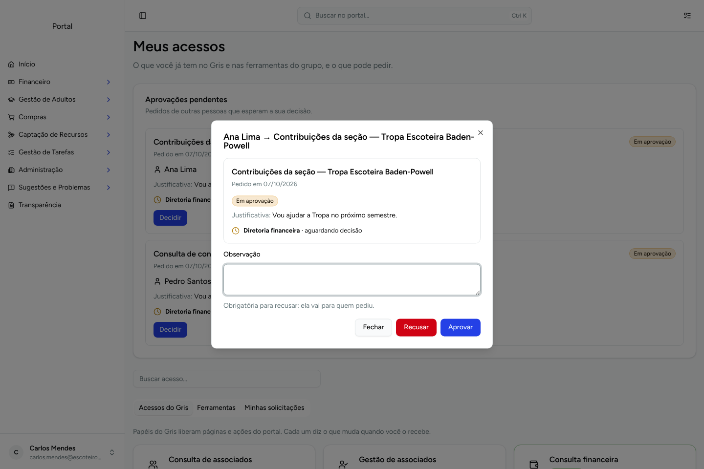

**8. Segue com acesso total**

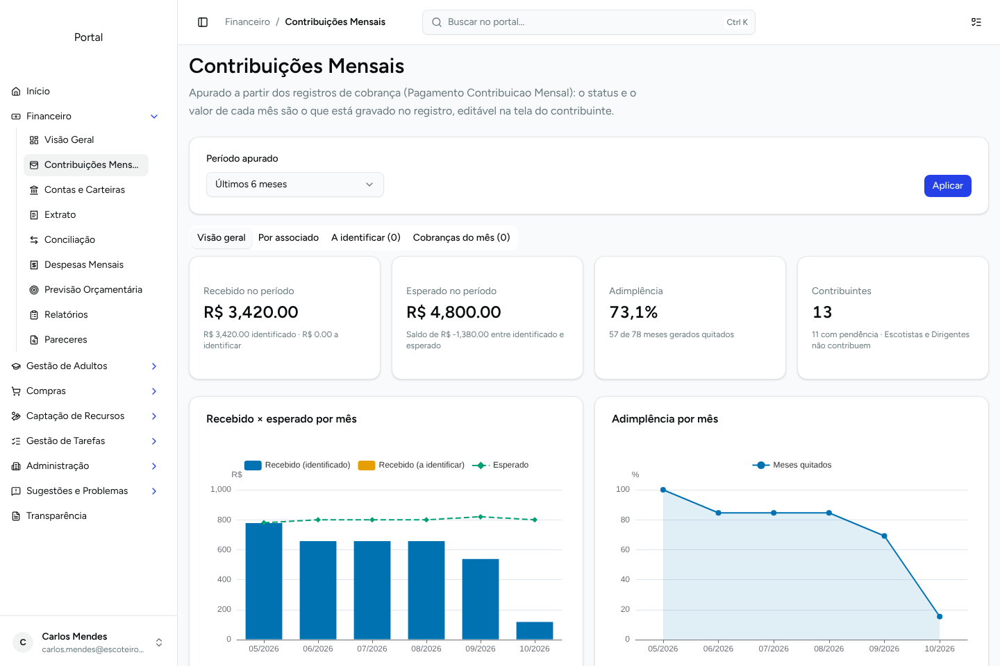

## Gestão de acessos

**9. Card do acesso por seção**

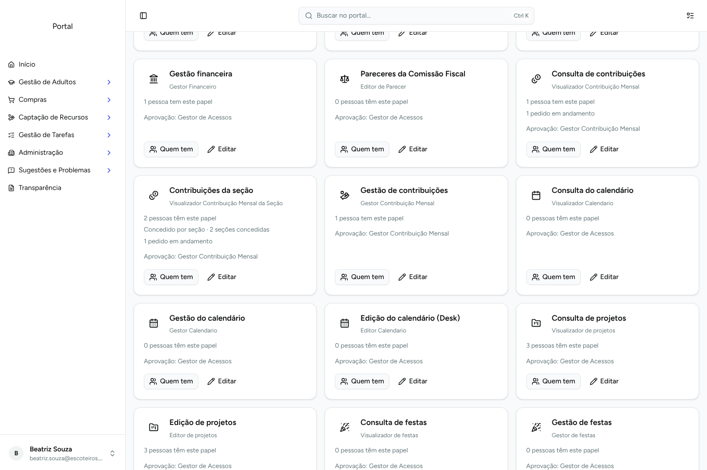

**10. Quem tem: seções por pessoa e concessão direta**

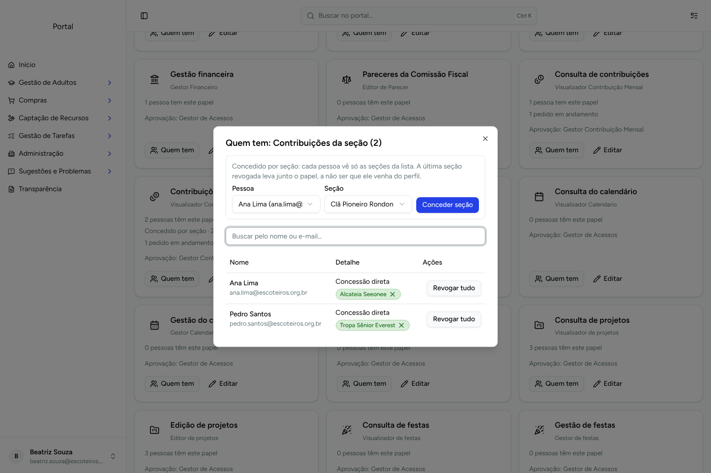

**11. Solicitações com a seção**

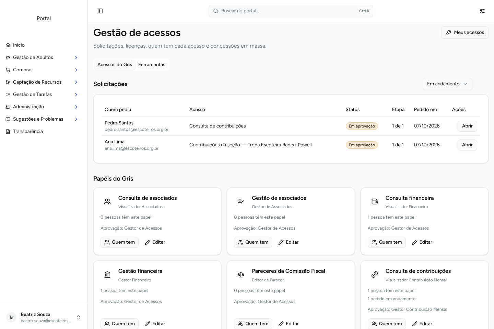

## Responsável com dois filhos

Marina é responsável por Lucas (Alcateia, em dia, só o mês corrente em aberto) e Sofia (Tropa Escoteira, dois meses em atraso). Helena, de outra família, não aparece.

**12. A mãe vê os dois filhos, cada um com a própria situação e o próprio botão de pagar; o aviso do topo soma as duas pendências (R$ 60 + R$ 200)**

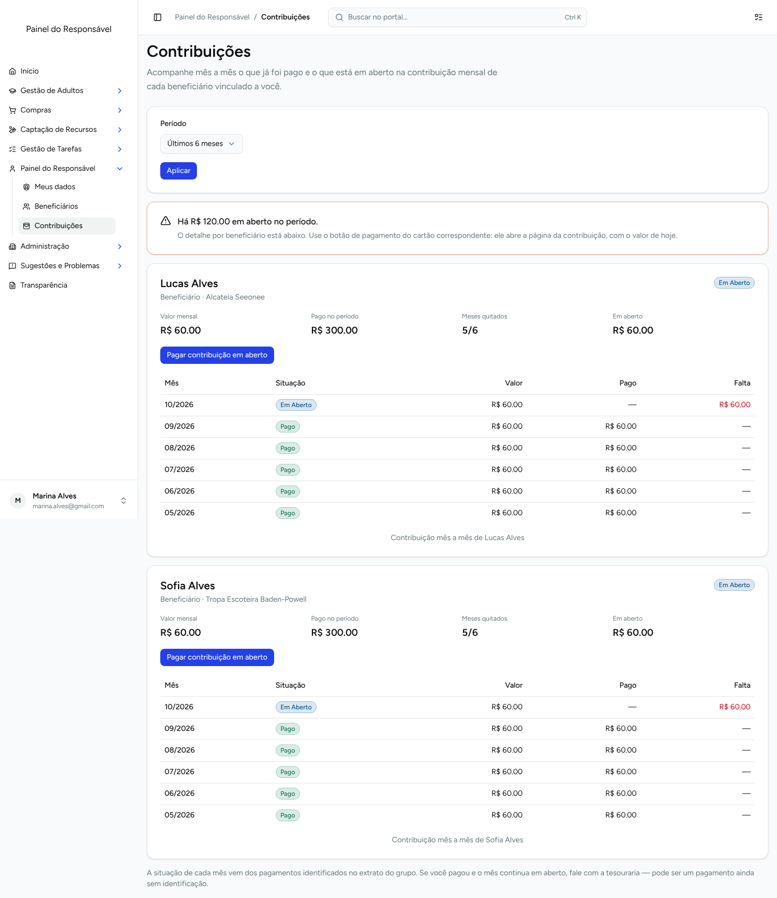

**13. Celular**

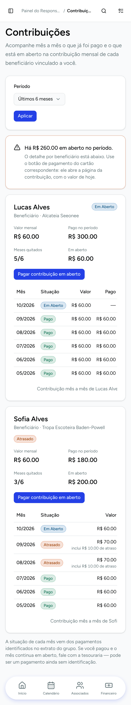

**14. A conta id@escoteiros da Sofia não chega ao irmão pelo vínculo dela**

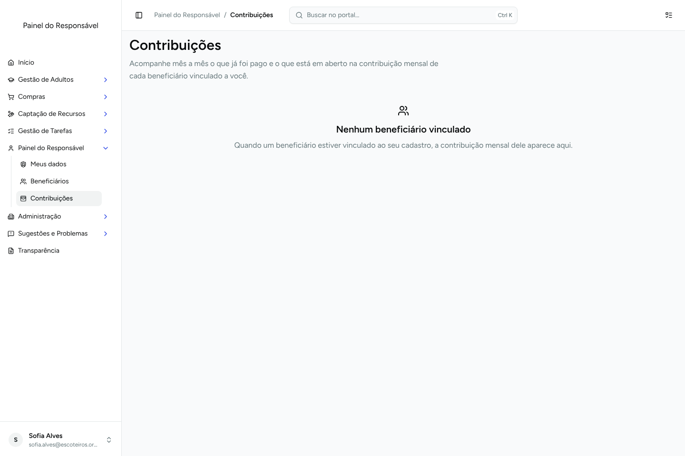

**15. Responsável não pede acessos de contribuição no portal**

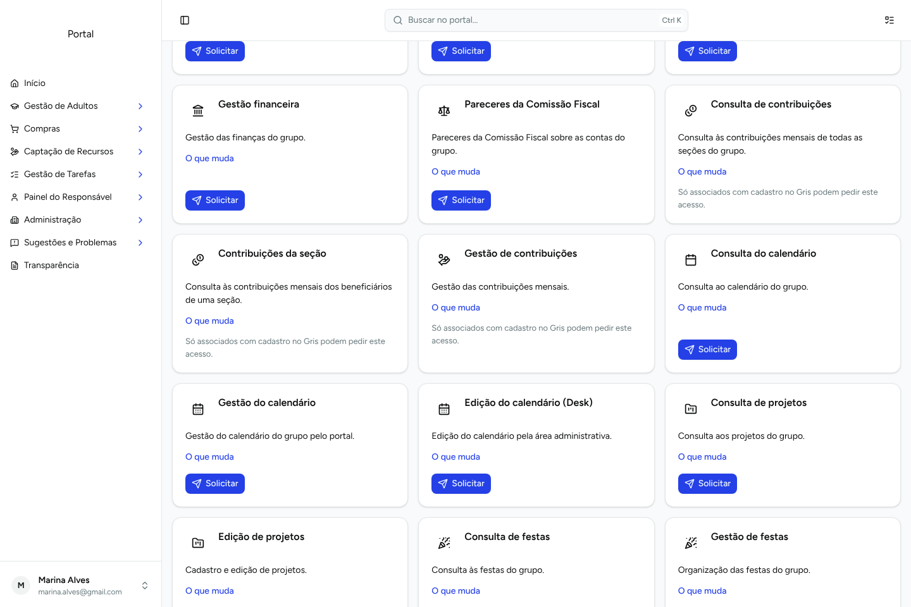

## Celular

**16. Card do acesso por seção**

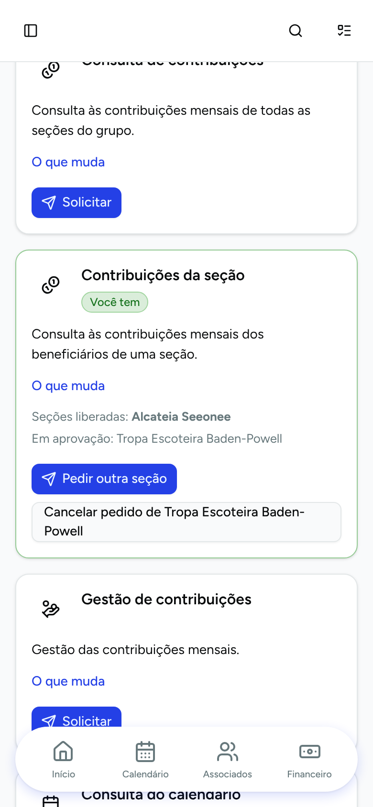
